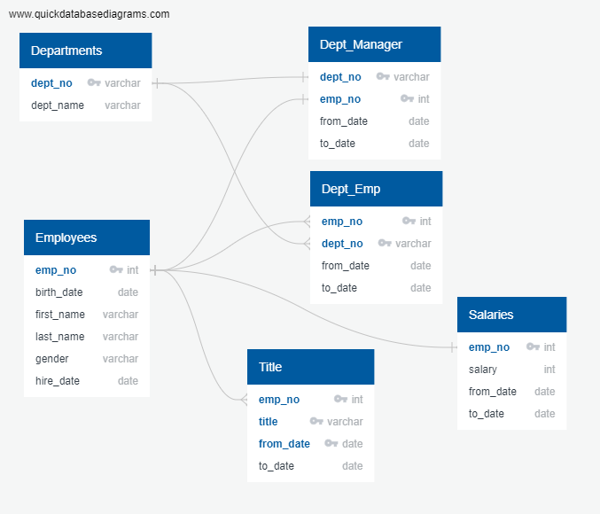
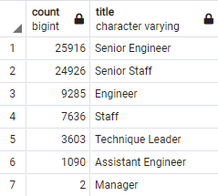
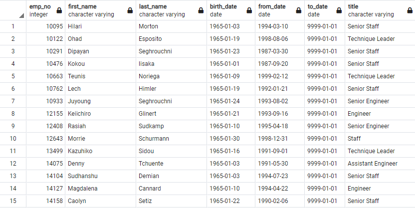

# Pewlett Hackard Analysis with SQL

## Overview

### Purpose

Pewlett Hackard is a large company that is at risk of losing many employees in what could be a called a "silver tsunami". It's important for the company to consider who will be filling in those positions as employees leave, particularly leadership positions. After completing an initial analysis on the employees close to retirement, we now have two more goals. First, determine the number of retiring employees per job title. Second, identify employees that are eligible to participate in a mentorship program. 

### ERD

## Results

  - As shown in the retiring title table below, senior engineers and senior staff make up the largest groups of employees who are close to retirement. This makes sense because these employees are at the end of their careers, so they're more likely to be in roles with more responsibility. 
  - Interestingly enough, there are only two managers close to retirement. Either there are few managers overall, or a younger cohort has already taken over those positions. 

  - Many employees in the mentorship eligibility table, part of which is shown below, are already in senior or leadership positions. They may or may not need further mentorship.
  - Some employees look like they joined the company right after college, while others joined some time later. Employees who have been at the company for a shorter period of time may be more likely to need mentorship. 

## Summary 

How many roles will need to be filled as the "silver tsunami" begins to make an impact?
  - Summing up the employees from the retiring titles table, there are 72,458 roles that will need to be filled as these employees retire. 

Are there enough qualified, retirement-ready employees in the departments to mentor the next generation of Pewlett Hackard employees?
  - There are only 1,549 employees in the mentorship eligibility table, so based on that alone there should in general be plenty of retirement-ready employees to mentor them. The real question is if there will be enough employees ready to take on the roles left by those about to retire. 

It might be a good idea to perform another query where we find the number of retirement-ready employees in each title per department. That way we would be better able to answer if each individual department will have employees who can mentor the next generation before leaving. Additionally, our mentorship eligibility table only included employees born in 1965. It may be valuable to extend that search to a wider range considering we have far more retirement-ready employees than employees who can be mentored. In that search we can also include department, so we can get a better sense of which employees are ready to be mentored per department.
